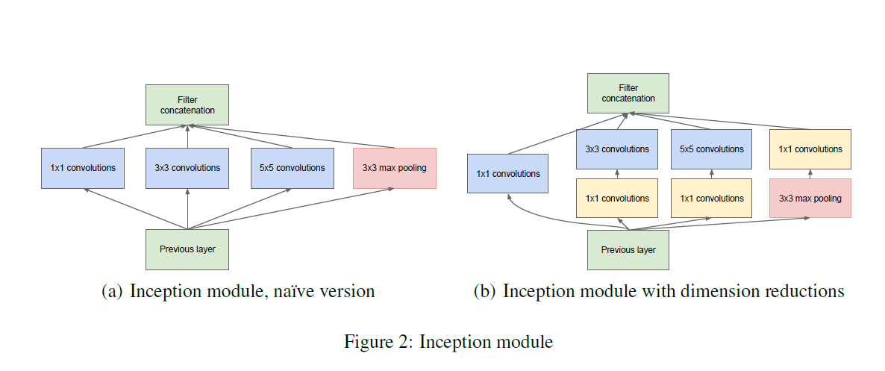
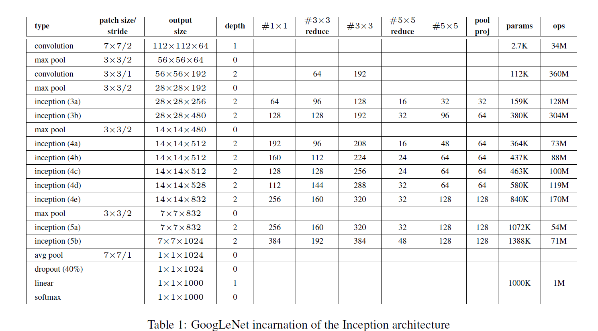

## InceptionNet - GoogLeNet Architecture

The architecture details of GoogLeNet is tabulated down below:-  

## Notes

You can find the model implementation in `InceptionNet.py` file.  
The training code can be found in `train.py`.  
  
I have ensured that maximum control is given to the user.  
* You can set whether you want to include Batch Normalization layers in the Convolution Block by setting the `use_batchnorm` parameter to `True` or `False`.
* Similarly, you can choose whether to include the auxiliary classifier when training the model by setting the `aux_network` parameter to `True` or `False`.

For example,  
`model = GoogLeNet(in_channels = 3, num_classes = 10, aux_network = True, use_batchnorm = True)`

This makes sure that the model includes both Batch Normalization layers as well as the Auxiliary Classifiers during training.

## References
[Going deeper with convolutions](https://arxiv.org/pdf/1409.4842.pdf)

