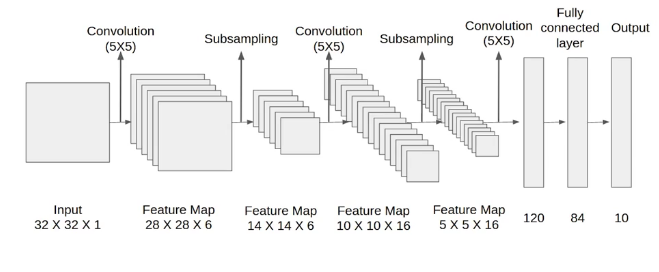

## LeNet Architecture

`LeNet.py` contains the LeNet architecture.  
`mnist_main.py` is a script that uses the above said architecture for training a digit classification model.

## Notes

Do note that the original paper employed "Tanh" as the activation function. I have used "ReLU" here because of it's simplicity and improved performance.

## References

 [Gradient-Based Learning Applied to Document Recognition](http://yann.lecun.com/exdb/publis/pdf/lecun-01a.pdf)
