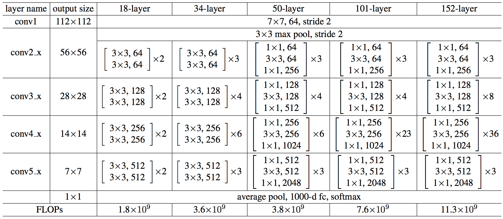

## ResNet Architecture

  

The architecture of all the variants of ResNet is shown above.  

### ResNet Block
Here is a sample resnet block that shows the use of skip-connections.  
  

## Notes
You can find my implementation of all the variants of ResNet in `resnet.py`.
The variants are:-
- ResNet-18
- ResNet-34
- ResNet-50
- ResNet-101
- ResNet-152

## Example Commands

You can import the resnet module as given below  
`from resnet import resnet18, resnet34, resnet50, resnet101, resnet152`  

For ResNet-18:  
`model = resnet18()`  
  
For ResNet-34:  
`model = resnet18()`  
  
For ResNet-50:  
`model = resnet18()`  
  
For ResNet-101:  
`model = resnet18()`  
  
For ResNet-152:  
`model = resnet18()`  
  
  
## Reference
[Deep Residual Learning for Image Recognition](https://arxiv.org/abs/1512.03385)
