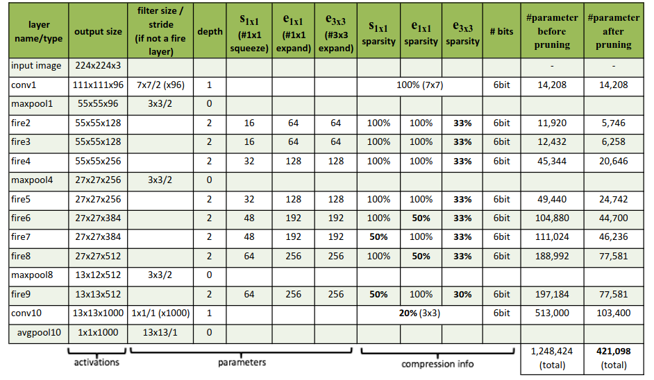
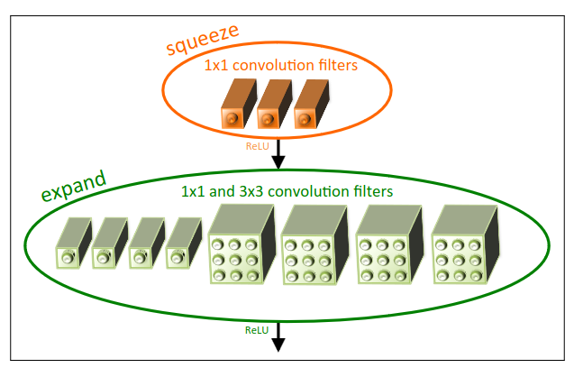

## SqueezeNet Architecture

## Fire Module

## Notes
`squeezenet.py` contains the SqueezeNet model code.  

## References
[SqueezeNet: AlexNet-level accuracy with 50x fewer parameters and <0.5MB model size](https://arxiv.org/abs/1602.07360)
